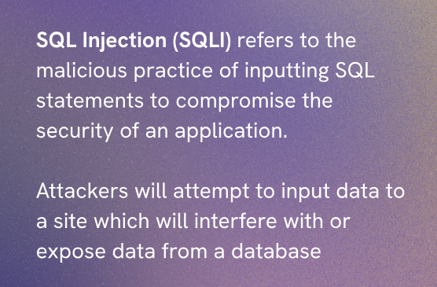
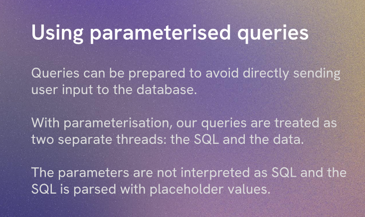
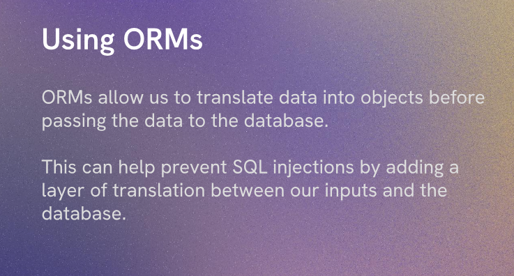
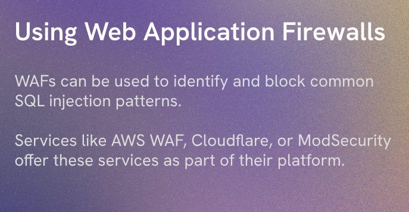

SQL Injections are a type of security vulnerability that allows attackers to execute arbitrary SQL code on a database. This can lead to unauthorized access to data, data manipulation, and even complete control over the database.


Sql Injections occur when user input is not properly sanitized and is directly included in SQL queries. For example, if a login form takes a username and password and constructs a SQL query like this:
```sqlSELECT * FROM users WHERE username = 'user_input' AND password = 'user_input';
```If an attacker enters a malicious input like `' OR '1'='1`, the query becomes:
```sqlSELECT * FROM users WHERE username = '' OR '1'='1' AND password = '' OR '1'='1';
```This query will always return true, allowing the attacker to bypass authentication and gain access to the system.
To prevent SQL Injections, it is important to use parameterized queries or prepared statements, which ensure that user input is treated as data rather than executable code. Additionally, input validation and sanitization can help mitigate the risk of SQL Injections by ensuring that only expected and safe input is accepted.
In summary, SQL Injections are a serious security vulnerability that can have devastating consequences if not properly addressed. It is crucial for developers to be aware of this vulnerability and implement appropriate measures to protect their applications and databases from potential attacks.

SQL Injections can be used for:
1. Expose sensitive data: Attackers can use SQL Injections to retrieve sensitive information from the database, such as user credentials, personal information, or financial data.
2. Bypass authentication: As shown in the example above, attackers can use SQL Injections to bypass authentication mechanisms and gain unauthorized access to the system.
3. Modify or delete data: Attackers can use SQL Injections to modify or delete data in the database, which can lead to data loss or corruption.
4. Execute admin operations: If the attacker gains access to the database with sufficient privileges, they can execute administrative operations, such as creating new users, granting permissions, or even dropping tables.

Use of parameterized queries or prepared statements is crucial in preventing SQL Injections. These techniques ensure that user input is treated as data rather than executable code, which helps to mitigate the risk of SQL Injections. Additionally, input validation and sanitization can further enhance security by ensuring that only expected and safe input is accepted. It is important for developers to be vigilant and implement these measures to protect their applications and databases from potential attacks.
example of parameterized query in Node.js using the `pg` library:
```javascriptconst { Pool } = require('pg');
const pool = new Pool({
  user: 'your_username',
  host: 'localhost',
    database: 'your_database',
    password: 'your_password',
    port: 5432,
  });
const username = 'user_input';
const password = 'user_input';
const query = 'SELECT * FROM users WHERE username = $1 AND password = $2';
pool.query(query, [username, password], (err, res) => {
  if (err) {
    console.error('Error executing query', err.stack);
  } else {
    console.log('Query result:', res.rows);
  }
});
```In this example, the user input is passed as parameters to the query, which prevents SQL Injections by treating the input as data rather than executable code.
Explaination of the code above:
1. We import the `Pool` class from the `pg` library, which is used to manage a pool of connections to the PostgreSQL database.
2. We create a new instance of the `Pool` class, providing the necessary configuration for connecting to the database, such as the username, host, database name, password, and port.
3. We define the user input for the username and password, which would typically come from a form or user input in a real application.
4. We construct a parameterized SQL query using placeholders (`$1` and `$2`) for the user input values.
5. We execute the query using the `pool.query` method, passing the query string and an array of parameters that correspond to the placeholders in the query.
6. We handle the result of the query in a callback function, logging any errors that occur or the query results if the execution is successful. This approach ensures that the user input is safely handled and prevents SQL Injections.
In conclusion, SQL Injections are a critical security vulnerability that can have severe consequences if not properly addressed. It is essential for developers to understand the risks associated with SQL Injections and implement appropriate measures, such as using parameterized queries and input validation, to protect their applications and databases from potential attacks. By following best practices for secure coding, developers can help ensure the integrity and security of their applications and the data they manage.

Injections can be prevented by:
1. Using parameterized queries or prepared statements: This ensures that user input is treated as data rather than executable code, preventing SQL Injections.
2. Input validation and sanitization: Implementing input validation and sanitization can help ensure that only expected and safe input is accepted, reducing the risk of SQL Injections.
3. Limiting database permissions: Restricting the permissions of database users can help mitigate the impact of a successful SQL Injection attack by limiting the actions that an attacker can perform on the database.
4. Using ORMs (Object-Relational Mappers): ORMs can help abstract away direct SQL queries and provide a safer interface for interacting with the database, reducing the risk of SQL Injections.
5. Regularly updating and patching software: Keeping your database management system and related software up to date can help protect against known vulnerabilities that could be exploited for SQL Injections.By implementing these measures, developers can significantly reduce the risk of SQL Injections and enhance the security of their applications and databases. It is crucial to be proactive in addressing security vulnerabilities and to stay informed about best practices for secure coding to protect against potential attacks.
6. Using Web Application Firewalls (WAFs): WAFs can help detect and block malicious traffic, including SQL Injection attempts, by analyzing incoming requests and applying security rules. This can provide an additional layer of defense against SQL Injections and other types of attacks.
7. Educating developers and users: Providing training and resources for developers on secure coding practices and raising awareness among users about the risks of SQL Injections can help create a culture of security and encourage responsible behavior when handling user input and interacting with databases. By fostering a security-conscious mindset, organizations can better protect their applications and data from potential threats.In summary, SQL Injections are a significant security concern that can lead to unauthorized access, data manipulation, and other malicious activities. By implementing a combination of preventive measures, such as using parameterized queries, input validation, limiting permissions, and educating developers and users, organizations can effectively mitigate the risks associated with SQL Injections and enhance the overall security of their applications and databases. It is essential to stay vigilant and proactive in addressing security vulnerabilities to protect against potential attacks and ensure the integrity of your applications and data.

Using Parameterized Queries or Prepared Statements is a crucial step in preventing SQL Injections. These techniques ensure that user input is treated as data rather than executable code, which helps to mitigate the risk of SQL Injections. By using parameterized queries, developers can safely handle user input and prevent attackers from injecting malicious SQL code into their applications. Additionally, input validation and sanitization can further enhance security by ensuring that only expected and safe input is accepted. It is important for developers to be vigilant and implement these measures to protect their applications and databases from potential attacks.


Using ORMS (Object-Relational Mappers) can also help prevent SQL Injections by abstracting away direct SQL queries and providing a safer interface for interacting with the database. ORMs allow developers to work with database objects and relationships using high-level programming languages, which can help reduce the risk of SQL Injections by automatically handling user input and generating safe SQL queries. By using an ORM, developers can focus on the logic of their application rather than worrying about the intricacies of SQL syntax and security, ultimately enhancing the security of their applications and databases.


Validating and Santizing User Input is another important measure to prevent SQL Injections. By implementing input validation, developers can ensure that only expected and safe input is accepted, reducing the risk of SQL Injections. This can be done by checking the format, length, and type of user input before processing it. Additionally, sanitizing user input involves removing or escaping any potentially harmful characters that could be used in an SQL Injection attack. By validating and sanitizing user input, developers can significantly reduce the likelihood of SQL Injections and enhance the security of their applications and databases.


Using Web Application Firewalls (WAFs) can provide an additional layer of defense against SQL Injections by analyzing incoming requests and applying security rules to detect and block malicious traffic. WAFs can help identify and prevent SQL Injection attempts by monitoring for suspicious patterns in user input and blocking requests that match known attack signatures. By implementing a WAF, organizations can enhance their security posture and reduce the risk of successful SQL Injection attacks, providing an extra safeguard for their applications and databases.
