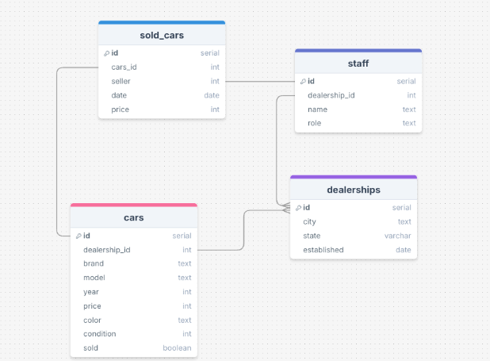
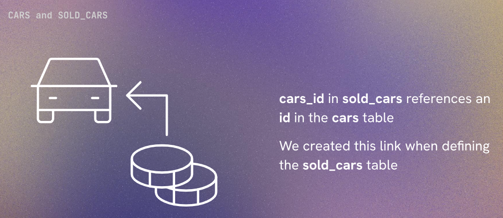
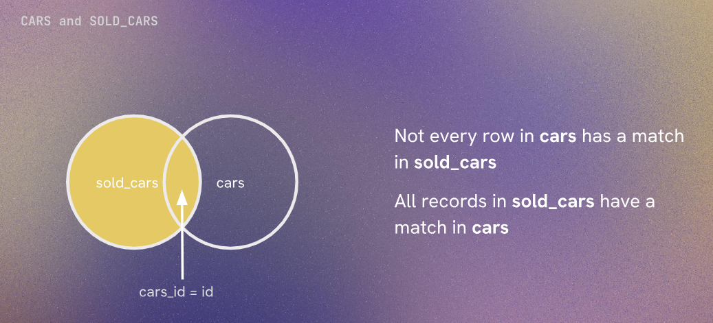
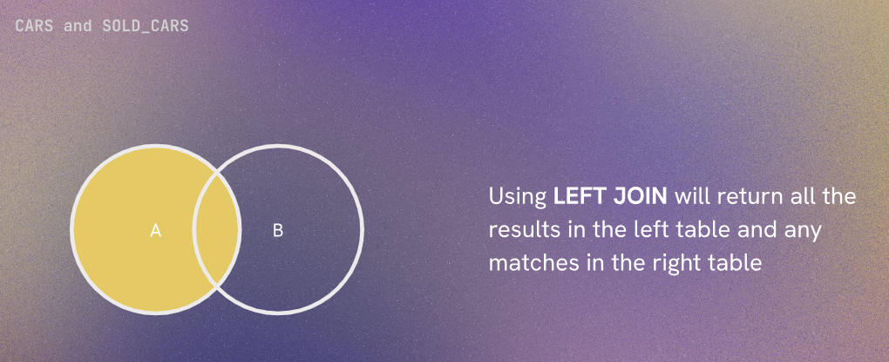
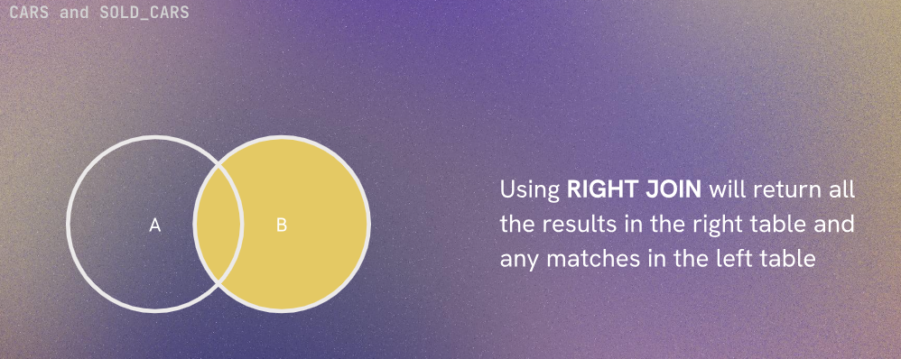
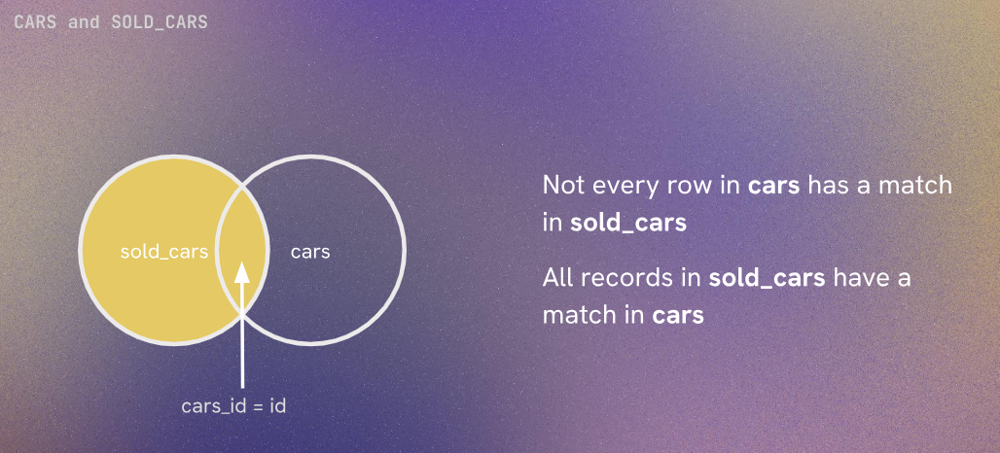
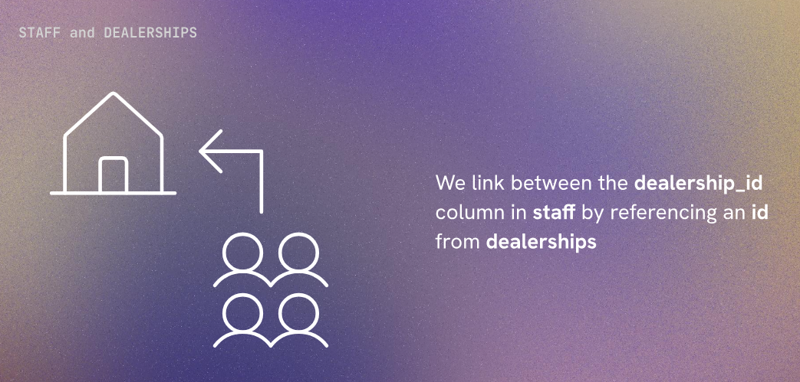
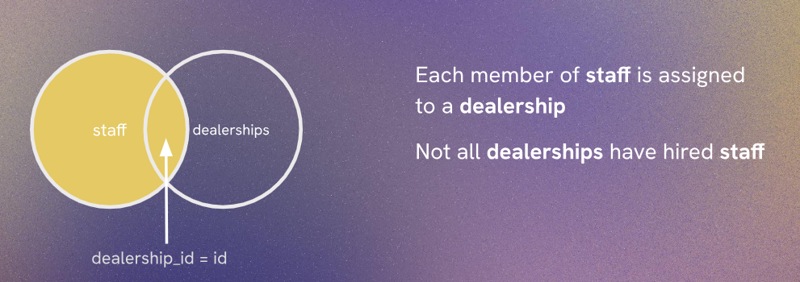

# Left and Right Joins

Understanding the different links between the tables will help us to understand different types of joins.









# Left Join

Suppose if we want to compare the price of cars that are sold with the original price of the cars. We can use the following query:

```sql
SELECT brand, model, price, sold, sold_price 
  FROM sold_cars
  LEFT JOIN cars ON sold_cars.cars_id = cars.id;
```
Explaination:
Whenever we are doing left join , we put the table that we want to keep all the records from on the left side of the join. In this case, we want to keep all the records from the sold_cars table, so we put it on the left side of the join. The cars table is on the right side of the join, so we will only get the records from the cars table that match with the sold_cars table.

We can also use table aliases to make our query more readable. For example:

```sql
SELECT brand, model, price, sold, sold_price 
  FROM sold_cars SC
  LEFT JOIN cars C ON SC.cars_id = C.id;
```
Here we have used the alias SC for the sold_cars table and C for the cars table. This makes our query more concise and easier to read.

# Right Join





We can include the records of cars we have not sold alongisde the cars that we have and we can do this by using right join. The query will be:

```sql
SELECT brand, model, price, sold, sold_price 
  FROM sold_cars SC
  RIGHT JOIN cars C ON SC.cars_id = C.id;
```
Explaination:
Here we are using right join, so we put the cars table on the right side of the join. This means that we will get all the records from the cars table, and only the matching records from the sold_cars table. If there is no match in the sold_cars table for a record in the cars table, we will get NULL values for the columns from the sold_cars table.





Suppose if want to want the list of staff and which dealership they work for, we can use the following query:

```sql
SELECT name, role, city, state FROM staff
  LEFT JOIN dealerships ON dealership_id = dealerships.id;
```

explaination:
Here we are using left join, so we put the staff table on the left side of the join. This means that we will get all the records from the staff table, and only the matching records from the dealerships table. If there is no match in the dealerships table for a record in the staff table, we will get NULL values for the columns from the dealerships table.

What will happen if we use right join instead of left join in the above query?

```sql
SELECT name, role, city, state FROM staff
  RIGHT JOIN dealerships ON dealership_id = dealerships.id;
```
Explaination:
Here we are using right join, so we put the dealerships table on the right side of the join. This means that we will get all the records from the dealerships table, and only the matching records from the staff table. If there is no match in the staff table for a record in the dealerships table, we will get NULL values for the columns from the staff table.