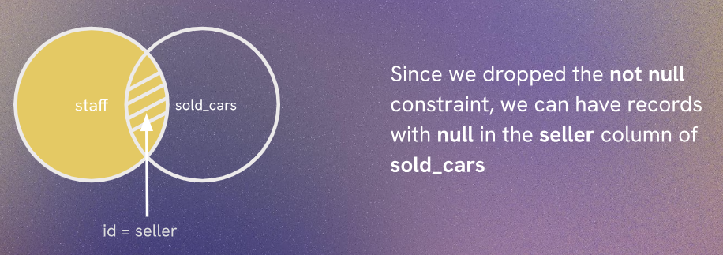
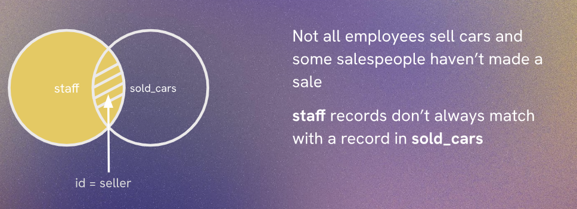

# Full join, Inner join and drop

## Inner Join
Inner join is a type of join that returns records that have matching values in both tables. It only returns the rows where there is a match in both tables.


## Full Join
Full join is a type of join that returns all records when there is a match in either left (table1) or right (table2) table records. It returns NULL for unmatched records from both sides.


## Drop Keyword

Drop keyword is used to delete a table or a database. When you drop a table, all the data and the structure of the table are removed permanently.
Drop allow us to remove tables, columns, and constraints from a database. It is a powerful command and should be used with caution as it can lead to data loss if not used properly.  

```sql
ALTER TABLE staff
ALTER COLUMN dealership_id DROP NOT NULL;
```
Explanation: This SQL command is used to modify the structure of the "staff" table. Specifically, it alters the "dealership_id" column by dropping the NOT NULL constraint. This means that after executing this command, the "dealership_id" column will allow NULL values, and it will no longer be mandatory to provide a value for this column when inserting or updating records in the "staff" table.

Suppose we try this out by inserting some new records into the staff table:

```sql
INSERT INTO staff (name, role)
 VALUES
 ('Tony Turner', 'Salesperson'),
 ('Axel Grimes', 'Salesperson'),
 ('Elle Bowgrease', 'Salesperson');
```
Since we have dropped the NOT NULL constraint on the "dealership_id" column, we can insert new records into the "staff" table without providing a value for the "dealership_id" column. The above SQL command will successfully insert three new records into the "staff" table with NULL values for the "dealership_id" column.

- Insert new dealerships opening 2027

```sql
INSERT INTO dealerships ( city, state, established )
	VALUES
	( 'Houston', 'TX', '2027-07-04' ),
	( 'Phoenix', 'AZ', '2027-07-04' ),
	( 'Dallas', 'TX', '2027-07-04' ),
	( 'Austin', 'TX', '2027-07-04' ),
	( 'Boston', 'MA', '2027-07-04');
```


To know all data of staff and dealership tables, using Full Join, we can use the following SQL command:

```sql
SELECT name, role, city, state FROM staff
	FULL JOIN dealerships ON dealership_id = dealerships.id;
```
This SQL command retrieves the name, role, city, and state from the "staff" table and performs a FULL JOIN with the "dealerships" table based on the condition that the "dealership_id" in the "staff" table matches the "id" in the "dealerships" table. The FULL JOIN ensures that all records from both tables are included in the result, even if there is no match between them. If there is no match, NULL values will be returned for the columns from the table that does not have a matching record.

Suppose if we want to get a list without null values, by using Inner Join ,we can use the following SQL command:

```sql
SELECT name, role, city, state FROM staff
	INNER JOIN dealerships ON dealership_id = dealerships.id;
```
This SQL command retrieves the name, role, city, and state from the "staff" table and performs an INNER JOIN with the "dealerships" table based on the condition that the "dealership_id" in the "staff" table matches the "id" in the "dealerships" table. The INNER JOIN ensures that only records with matching values in both tables are included in the result. If there is no match, those records will be excluded from the result set.

Now if we want to fire some particular record from the staff table, as we are firing a staff member, and deleting all its record from the database.  
so we have go in steps:
1. Alter table sold_cars alter column seller drop the not null constraint

```sql
ALTER TABLE sold_cars
ALTER COLUMN seller DROP NOT NULL;
```
This allows us to set the seller column to NULL for the staff member we want to fire.

2. Update sold_cars setting the seller to null where the seller was Frankie  
hint: you can select his id from staff in query.js first

```sql
UPDATE sold_cars SET seller = NULL WHERE seller = 5;
```
This SQL command updates the "sold_cars" table by setting the "seller" column to NULL for all records where the "seller" value is 5. This effectively disassociates any sold cars from the staff member with an ID of 5, which is likely the staff member we want to fire.

3. Delete Frankie Fender from the staff table

```sql
DELETE FROM staff WHERE name = 'Frankie Fender';
```
This SQL command deletes the record from the "staff" table where the name is 'Frankie Fender'. This will permanently remove Frankie Fender's record from the "staff" table.






Now if we want to know who is the best performing salesperson and the sales that they have made, we can use the following SQL command:

If we do by Inner Join
```sql
SELECT name, role, sold_price FROM staff
	INNER JOIN sold_cars ON staff.id = seller;
```

And If we do by Full Join
```sql
SELECT name, role, sold_price FROM staff
	FULL JOIN sold_cars ON staff.id = seller;
```

In the above case of Inner join, we will only get the records of the staff members who have made sales, while in the case of Full join, we will get all staff members, including those who have not made any sales, with NULL values for the sold_price column for those who haven't made sales.