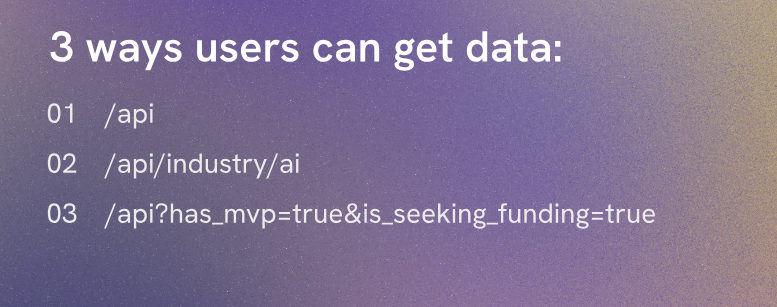
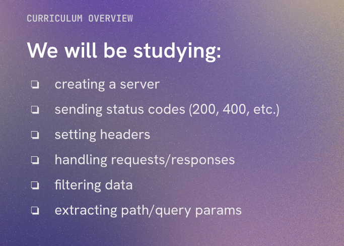

# Startup Planet Intro

Welcome to Startup Planet, your ultimate destination for all things related to startups and entrepreneurship. Whether you're an aspiring entrepreneur, a seasoned business owner, or simply interested in the world of startups, you've come to the right place.

- This API will provide data about startups, what they do, when they were founded, their location, and more. You can use this data to learn about different startups, analyze trends in the startup ecosystem, or even find potential investment opportunities.

We will be doing this:

simple api requests, path params and query params, and more. By the end of this course, you will have a solid understanding of how to build and work with APIs, and you'll be able to create your own API to share data with others. So let's get started on this exciting journey into the world of APIs!

