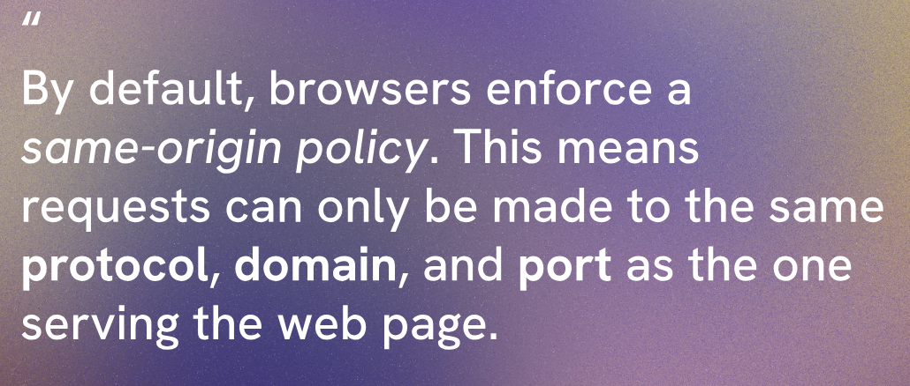
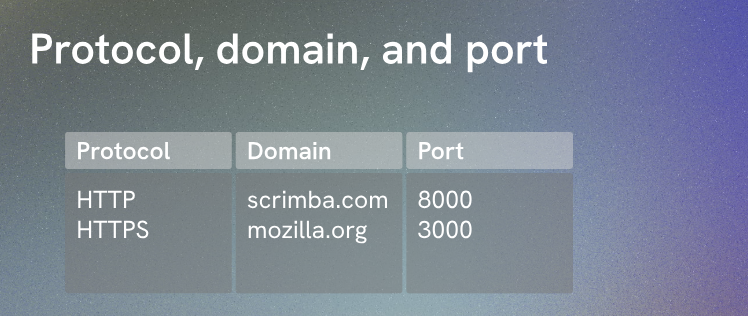
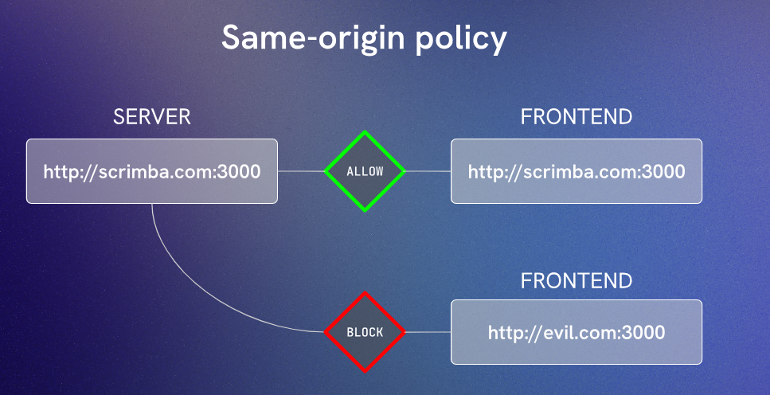
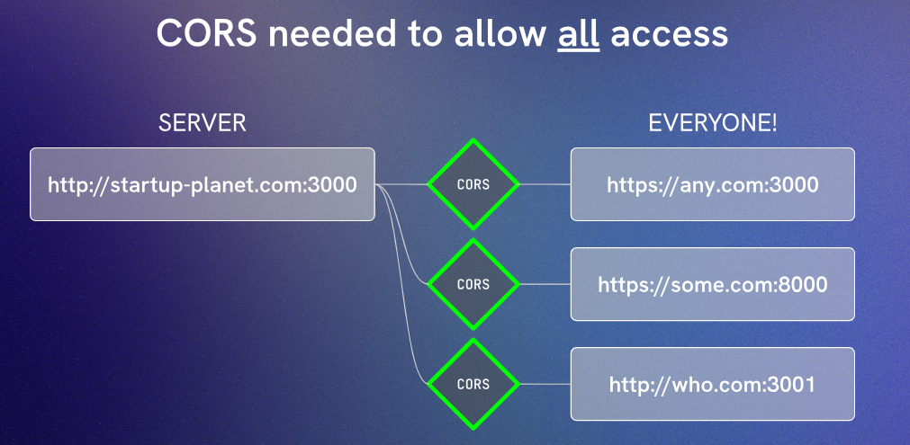

# CORS

CORS stands for Cross-Origin Resource Sharing. It is a security feature implemented by web browsers to restrict web pages from making requests to a different domain than the one that served the web page. This is done to prevent malicious websites from accessing sensitive data on other websites.

When a web page makes a request to a different domain, the browser sends an HTTP request with an `Origin` header that indicates the origin of the request. The server can then respond with specific headers to indicate whether the request is allowed or not.









Express make it very easy to handle CORS by using the `cors` middleware. You can install it using npm:

```bash
npm install cors
```

Then, you can use it in your Express application like this:

```javascript
import express from 'express'
import { apiRouter } from './routes/apiRoutes.js'
import cors from 'cors'

const PORT = 8000

const app = express()

app.use(cors())

app.use('/api', apiRouter)

app.use((req, res) => {
  res.status(404).json({ message: "Endpoint not found. Please check the API documentation." })
})


app.listen(PORT, () => console.log(`server connected on port ${PORT}`))
```
This `app.use(cors())` line will enable CORS for all routes in your application, allowing requests from any origin to access your API. This is useful during development or if you want to make your API publicly accessible. However, in a production environment, you may want to restrict access to specific origins for security reasons.  
Using the `cors` middleware will allow all cross-origin requests by default. However, you can also configure it to allow only specific origins or HTTP methods if needed. For example, to allow only requests from `http://example.com`, you can do this:

```javascript
app.use(cors({
  origin: 'http://example.com'
}))
```
This will ensure that only requests coming from `http://example.com` are allowed to access your API, while requests from other origins will be blocked by the browser. You can also specify multiple origins or use a function to dynamically determine whether to allow a request based on its origin.

```javascript
app.use(cors({
  origin: function (origin, callback) {
    const allowedOrigins = ['http://example.com', 'http://another-example.com']
    if (allowedOrigins.includes(origin)) {
      callback(null, true)
    } else {
      callback(new Error('Not allowed by CORS'))
    }
  }
}))
```
In this example, we have defined a function that checks if the incoming request's origin is in the list of allowed origins. If it is, we call the callback with `null` and `true` to allow the request. If it is not, we call the callback with an error to block the request. This way, you can have more control over which origins are allowed to access your API while still providing the necessary CORS headers for valid requests.
