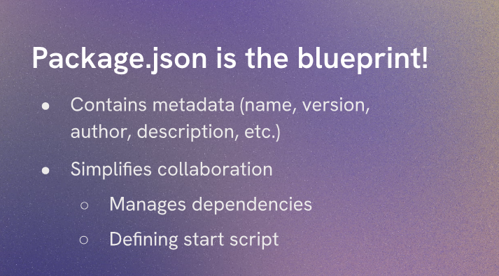

# Setting things up



Now we can express our app and start building our API. We will be using Express.js, a popular web application framework for Node.js, to create our API. Express.js provides a simple and flexible way to build web applications and APIs, making it easier to handle HTTP requests, routing, and middleware.

To get started, we need to install Express.js in our project. We can do this by running the following command in our terminal:

```
npm install express
```