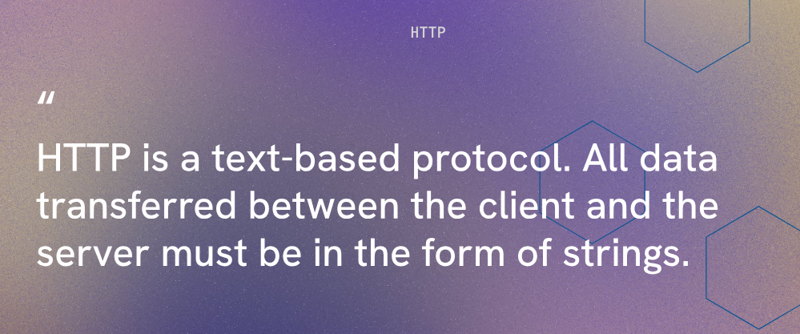

# Aside : Sending a Response



we can create a basic server that listens on a specific port and responds to incoming requests. 

Inside a server.js file we can write the following code to create a basic server that sends a response to incoming requests:

```javascript 
import express from 'express'

const celebrity = {
  type: "action hero",
  name: "JSON Statham"
}

const app = express()

app.get('/', (req, res) => {
  res.json(celebrity)  
})

app.listen(8000, () => console.log('listening 8000'))
```

In the code above, we define a route for the root URL ('/') using the `app.get()` method. When a GET request is made to the root URL, the callback function is executed, which sends a JSON response containing the `celebrity` object using the `res.json()` method.

When you run this server and navigate to `http://localhost:8000/` in your browser or make a GET request to that URL using a tool like Postman, you will receive a JSON response with the details of the celebrity.

the app.get() method is used to define a route for handling GET requests to the specified URL. In this case, we are defining a route for the root URL ('/'). When a GET request is made to this URL, the callback function is executed, which sends a JSON response containing the `celebrity` object using the `res.json()` method.