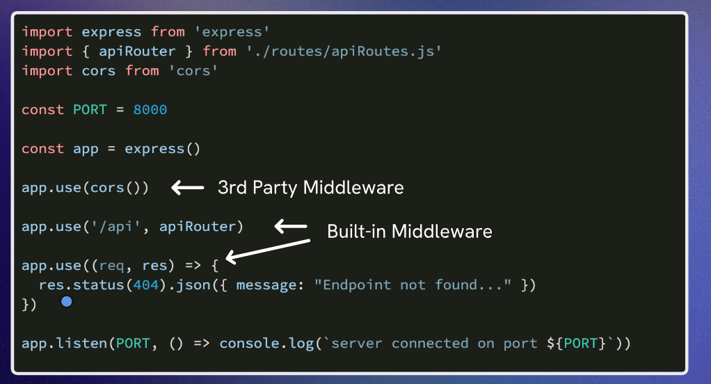

# Aside: Middleware and Express.static()

## Middleware
Middleware functions are functions that have access to the request object (req), the response object (res), and the next middleware function in the application’s request-response cycle. Middleware functions can perform the following tasks:
- Execute any code.
- Make changes to the request and the response objects.
- End the request-response cycle.


### Types of Middleware
1. Application-level middleware: This type of middleware is bound to an instance of the Express application
2. Router-level middleware: This type of middleware is bound to an instance of the Express router.
3. Error-handling middleware: This type of middleware is defined with four arguments and is used


Site to read more about middleware: https://expressjs.com/en/guide/using-middleware.html

`app.use()` is used to mount the specified middleware function(s) at the path which is being specified. If no path is specified, it defaults to "/". This means that the middleware function will be executed for every request to the app.

```JS
app.use((req, res, next) => {

    console.log('Custom headers added')
    next()

})

app.use((req, res, next) => {

    console.log(`[${new Date().toISOString()}] ${req.method} ${req.url}`)
    next()

})

app.get('/', (req, res) => {
    res.send('<!doctype html><html><body>Hello Express!</body></html>')
})
```
Here, we have defined two middleware functions. The first one logs a message to the console, and the second one logs the request method and URL along with a timestamp. Both middleware functions call `next()`, which allows the request to proceed to the next middleware function or route handler.

`next()` is a function that is used to pass control to the next middleware function in the stack. If the current middleware function does not end the request-response cycle, it must call `next()` to pass control to the next middleware function. Otherwise, the request will be left hanging and the client will not receive a response.  
It is used only in case of custom middleware functions. For built-in middleware functions, you do not need to call `next()` as they are designed to handle the request and response on their own.



`app.use()` can also be used to mount built-in middleware functions, such as `express.static()`, which is used to serve static files. When you use `express.static()`, it serves the files from the specified directory and does not call `next()`, as it ends the request-response cycle by sending the file to the client.

```JS
app.use(express.static('public'))
```
In this example, `express.static('public')` serves the static files from the 'public' directory. When a request is made for a file that exists in the 'public' directory, it will be served directly to the client, and `next()` will not be called. If the file does not exist, the request will continue to the next middleware function or route handler.