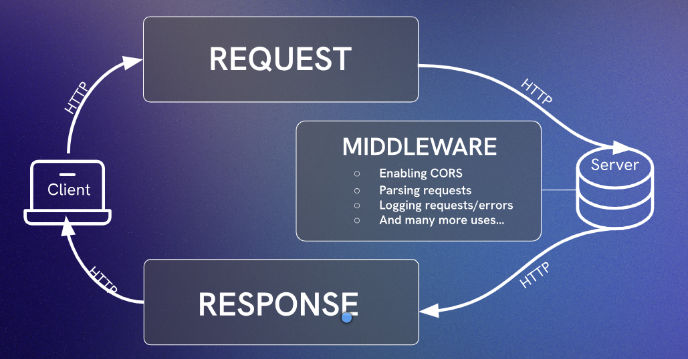
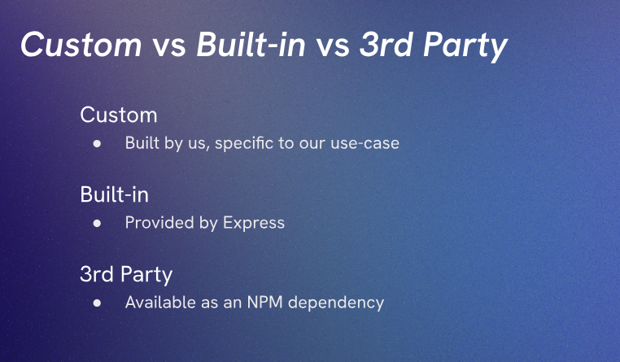

# Aside: Middleware and Express.static()

## Middleware
Middleware functions are functions that have access to the request object (req), the response object (res), and the next middleware function in the application’s request-response cycle. Middleware functions can perform the following tasks:
- Execute any code.
- Make changes to the request and the response objects.
- End the request-response cycle.

### Types of Middleware
1. Application-level middleware: This type of middleware is bound to an instance of the Express application
2. Router-level middleware: This type of middleware is bound to an instance of the Express router.
3. Error-handling middleware: This type of middleware is defined with four arguments and is used

Site to read more about middleware: https://expressjs.com/en/guide/using-middleware.html

`app.use()` is used to mount the specified middleware function(s) at the path which is being specified. If no path is specified, it defaults to "/". This means that the middleware function will be executed for every request to the app.