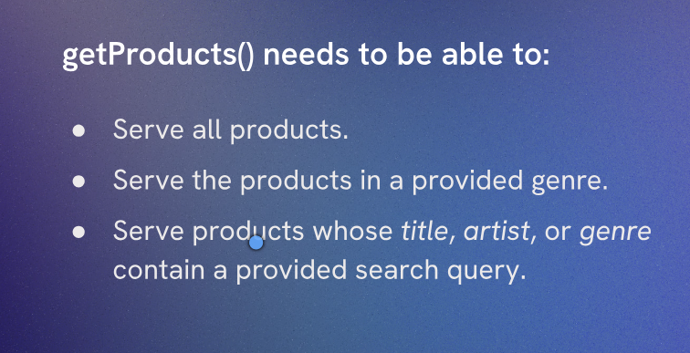

# Getting all Products



Challenge:
1. Write logic in getProducts() so all products display on page load.
	 
   As we will need to modify it in the next challenge, store the SQL query in a let and pass it into the all() method.

Inside `productsController.js` our code will look like this:

```js
export async function getProducts(req, res) {

  try {

    const db = await getDBConnection()

    let query = 'SELECT * FROM products'

    const products = await db.all(query)

    res.json(produ cts)

  } catch (err) {

    res.status(500).json({error: 'Failed to fetch products', details: err.message})

  }

}
```
Explanation of the code:
1. We define an asynchronous function `getProducts` that takes in the request and response objects as parameters.
2. We establish a connection to the database using the `getDBConnection()` function.
3. We define a SQL query as a string to select all records from the `products` table and store it in a variable called `query`.
4. We execute the SQL query using the `db.all()` method, which returns an array of all matching records from the `products` table and store it in the `products` variable.
5. We send the `products` array as a JSON response to the client using `res.json(products)`.
6. If any error occurs during the database operations, we catch the error and send a JSON response with a status code of 500 and an error message indicating that fetching products failed, along with the error details.

