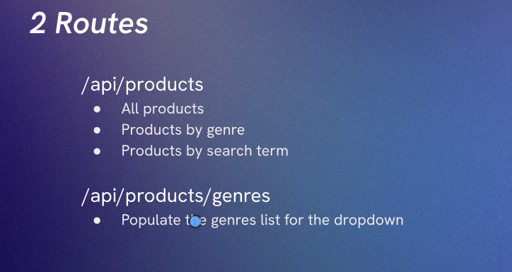

# Setting up the Route

Here we will setup 2 routes for our app.


in `poductController.js`:

```JS
export async function getGenres(){

  console.log('genres')

}

export async function getProducts(){

  console.log('products')

}
```

SO our 1st challenge is in `Products.js`:
Challenge 1:

  - Use express.Router() to export a router called productsRouter

It should mount the '/api/products' and '/api/products/genres' routes.
These should use the two functions from productsControllers.js: getProducts() and getGenres().
Be careful here - what is the common pitfall?

hint.md for help!


```JS
import express from 'express'
import { getProducts, getGenres } from '../controllers/productsControllers.js'

export const productsRouter = express.Router()

productsRouter.get('/genres', getGenres)
productsRouter.get('/', getProducts)
```
Here, we have created a router using `express.Router()`, and defined two routes: `/genres` and `/`. The `/genres` route will call the `getGenres` function from `productsControllers.js`, and the `/` route will call the `getProducts` function.

And our 2nd challenge is in `Server.js`:

Challenge 2:

- Handle any request to /api/products and pass it to productsRouter.

- Save and reload the mini browser. 
  You should see the results of the console.logs from productsControllers.js

```JS
app.use(express.static('public'))

app.use('/api/products', productsRouter)
```
Here, we have used `app.use()` to mount the `productsRouter` at the path `/api/products`. This means that any request to `/api/products` will be handled by the `productsRouter`, which will route the request to the appropriate handler based on the defined routes in `productsRouter`.