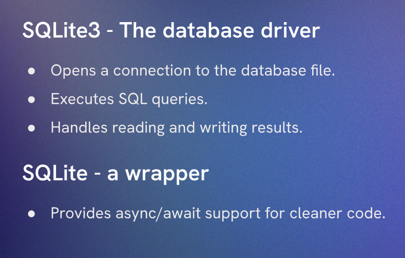

# Aside: Creating a DB Table

We will be using SQLite to create database in this project. SQLite is a self-contained, serverless, zero-configuration, transactional SQL database engine. It is a popular choice for small to medium-sized applications and is often used for development and testing purposes.

To download and use SQLite, you can follow these steps:

Use the teminal command `npm install sqlite3` to install the SQLite package for Node.js.



We can create a table in our project by using SQLite in a `createTable.js` file. This file will contain the code to create a table in our SQLite database.

```JS
import sqlite3 from 'sqlite3'
import { open } from 'sqlite'
import path from 'node:path'

async function createTable() {

  const db = await open({
    filename: path.join('database.db'),
    driver: sqlite3.Database
  })

  await db.exec(`
  CREATE TABLE IF NOT EXISTS abductions (
    id INTEGER PRIMARY KEY AUTOINCREMENT,
    location TEXT NOT NULL,
    details TEXT NOT NULL
  )
  `)

  await db.close()
  console.log('Table abductions created')
}
```

This code creates a table called `abductions` with three columns: `id`, `location`, and `details`. The `id` column is an integer that serves as the primary key and is set to auto-increment. The `location` and `details` columns are text fields that cannot be null.

This is an async function that opens a connection to the SQLite database, executes the SQL command to create the table if it does not already exist, and then closes the database connection. Finally, it logs a message to the console indicating that the table has been created.

`await db.exec()` is used to execute the SQL command to create the table. The `CREATE TABLE IF NOT EXISTS` statement ensures that the table is only created if it does not already exist in the database. This prevents errors from occurring if the table has already been created.

`await db.close()` is used to close the database connection after the table has been created. It is important to close the database connection to free up resources and prevent potential issues with multiple connections.

- This will create a file called `database.db` in the root directory of our project, which will contain the SQLite database. We can run this file using the command `node createTable.js` to create the table in the database.
- But this will primarily store the data in binary format, so we will not be able to see the contents of the database directly. To view the contents of the database, we can use a SQLite client or command-line tool that allows us to query the database and view its contents in a more human-readable format.

To view the contents of the database, you can use a SQLite client such as DB Browser for SQLite, which provides a graphical interface for managing and querying SQLite databases. Alternatively, you can use the command-line tool `sqlite3` to interact with the database directly from the terminal.

We can create a `logTable.js` file to log the contents of the `abductions` table. This file will contain the code to query the database and log the results to the console.

```JS
import sqlite3 from 'sqlite3'
import { open } from 'sqlite'
import path from 'node:path'


export async function viewAllProducts() {
  const db = await open({
    filename: path.join('database.db'), 
    driver: sqlite3.Database
  });

  try {
    const abductions = await db.all('SELECT * FROM abductions')
    console.table(abductions) 
  } catch (err) {
    console.error('Error fetching products:', err.message)
  } finally {
    await db.close()
  }
}

viewAllProducts()
```

This code defines an async function `viewAllProducts` that opens a connection to the SQLite database, executes a SQL query to select all records from the `abductions` table, and logs the results in a tabular format using `console.table()`. If there is an error during the query execution, it catches the error and logs an error message. Finally, it ensures that the database connection is closed after the operation is complete.

The `async function viewAllProducts()` is called at the end of the file to execute the function and log the contents of the `abductions` table to the console. You can run this file using the command `node logTable.js` to view the contents of the database.