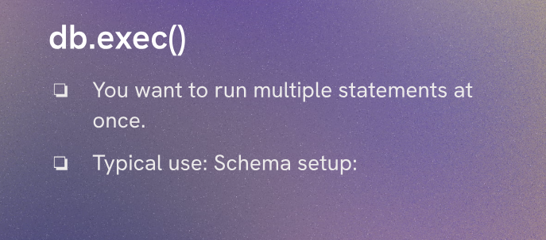
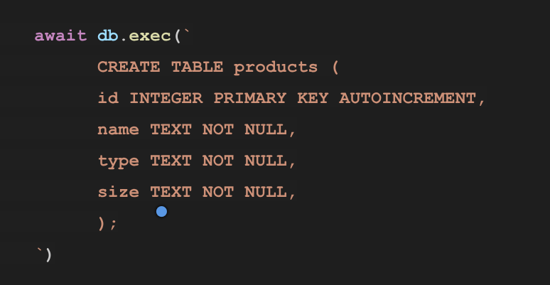
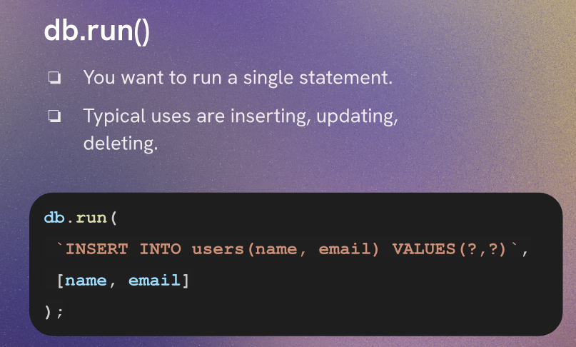
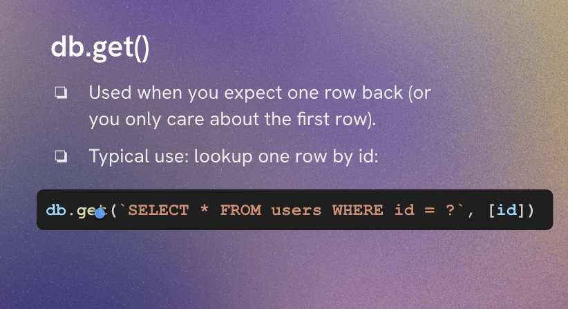
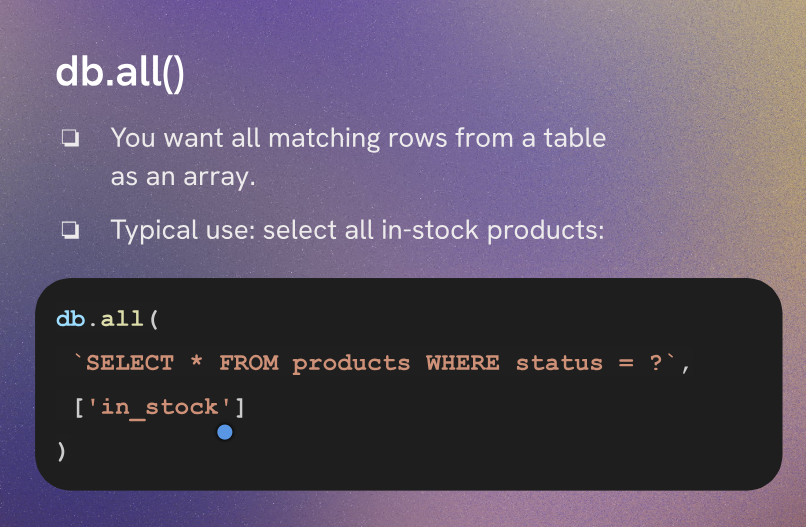

# sqlite3 Method Overview

## Useful Methods

1. `db.exec()` - This method is used to execute a SQL command that does not return any data. It is commonly used for creating tables, inserting data, or updating records.

2. `db.run()` - This method is used to execute a SQL command that modifies the database (like INSERT, UPDATE, DELETE) and does not return any data. It can also be used to get the last inserted ID.

Run and exec are kind of similar, but `run()` is more suitable for commands that modify the database, while `exec()` is better for commands that do not return data.
And exec can run multiple SQL statements at once, while run can only execute one statement at a time.

But Neither of them returns data from the database. If you want to retrieve data, you would use methods like `db.get()` or `db.all()`.

3. `db.get()` - This method is used to retrieve a single row of data from the database. It takes a SQL query and returns the first row that matches the query.

4. `db.all()` - This method is used to retrieve multiple rows of data from the database. It takes a SQL query and returns an array of all rows that match the query.
