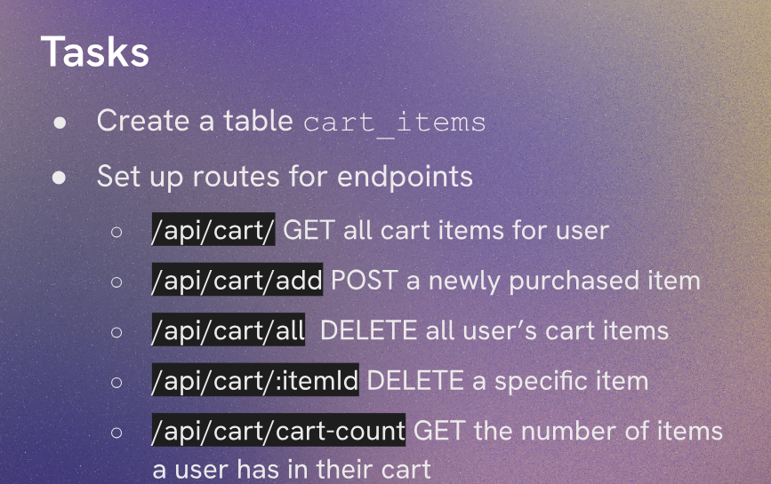
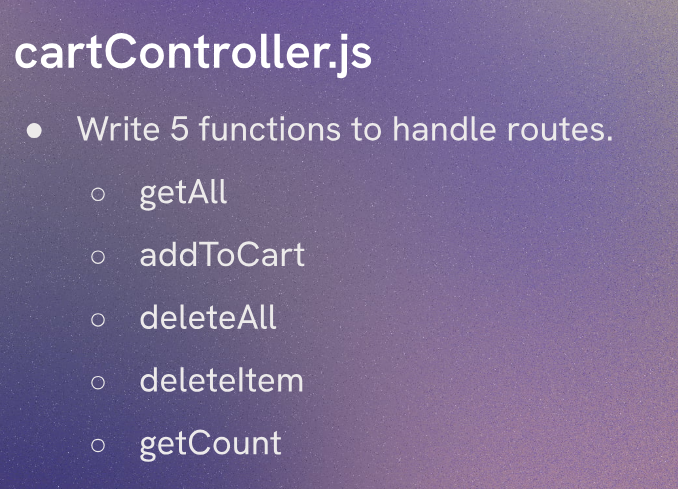

# Adding Cart Functionality

When a user wants to add an item to their cart, we need to check if they are logged in. If they are not logged in, we can return an error message indicating that they need to log in to add items to their cart. If they are logged in, we can proceed to add the item to their cart in the database.



We will create a `cartController.js`



We create a table for the cart in `createTable.js`

```js
import sqlite3 from 'sqlite3'
import { open } from 'sqlite'
import path from 'node:path'

async function createTable() {

     const db = await open({
           filename: path.join('database.db'),
           driver: sqlite3.Database
     })

     await db.exec(`
            CREATE TABLE cart_items (
                  id INTEGER PRIMARY KEY AUTOINCREMENT,
                  user_id INTEGER NOT NULL,
                  product_id INTEGER NOT NULL,
                  quantity INTEGER NOT NULL DEFAULT 1,
                  FOREIGN KEY (user_id) REFERENCES users(id),
                  FOREIGN KEY (product_id) REFERENCES products(id)
            );
     `)

     await db.close()
     console.log('table created')
} 

createTable()
```
This will create our Cart Table.