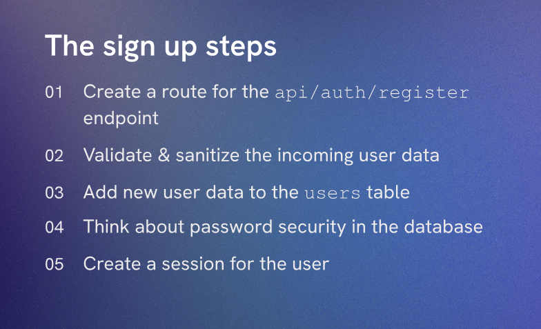

# The /register Route



So here We will Create a route for the api/auth/register endpoint. This will be a POST request that will allow users to register by providing their username and password. We will also hash the password before storing it in the database for security reasons.

Inside `authController.js`, we will add the following code to create the /register route:

```javascript
export async function registerUser(req, res) {

  console.log('req.body: ', req.body)

}
```
This function will handle the registration logic. For now, we are just logging the request body to see what data is being sent when a user tries to register. We will implement the actual registration logic in the next steps.

Inside `auth.js`, we will add the following code to set up the route:

```javascript
import { registerUser } from '../controllers/authController.js'
import express from 'express'

export const authRouter = express.Router()

authRouter.post('/register', registerUser)
```
This code imports the `registerUser` function from the `authController.js` file and sets up a POST route at `/register` that will call the `registerUser` function when a request is made to that endpoint. This will allow users to register by sending a POST request to `/api/auth/register` with their username and password in the request body.

Inside `server.js`, we will make sure to use the `authRouter` for the `/api/auth` endpoint:

```javascript
import { authRouter } from './routes/auth.js'

//middleware to use
app.use(express.json())

app.use('/api/auth', authRouter)
```
Here we are importing the `authRouter` and using it for any routes that start with `/api/auth`. This means that any requests to `/api/auth/register` will be handled by the `registerUser` function in the `authController.js` file. We also make sure to use `express.json()` middleware to parse the JSON request body.