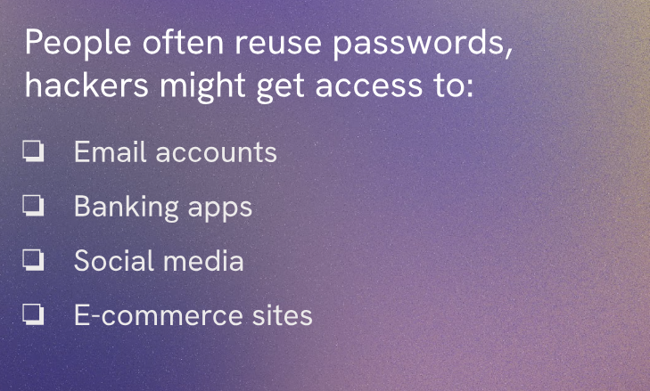
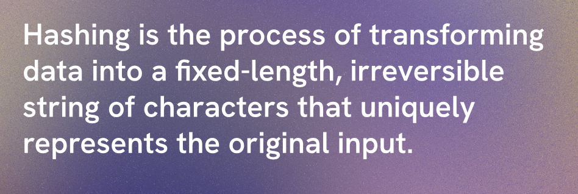
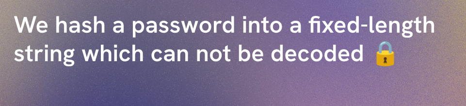
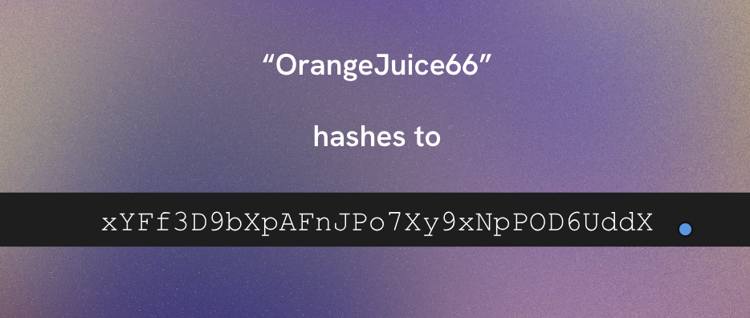
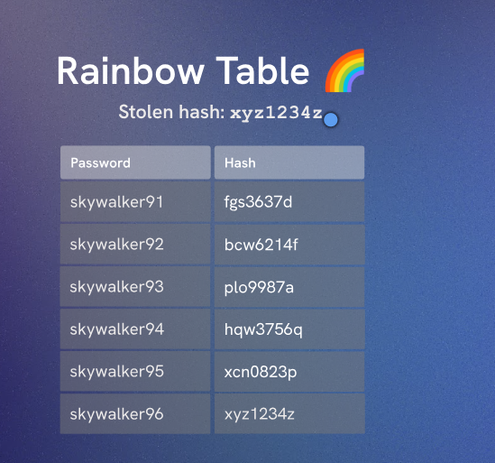
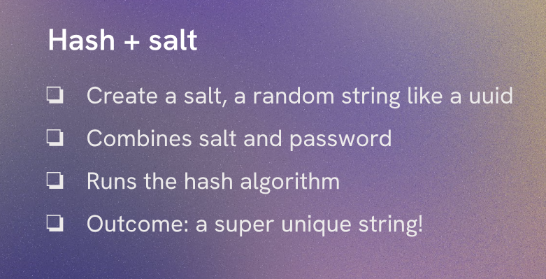
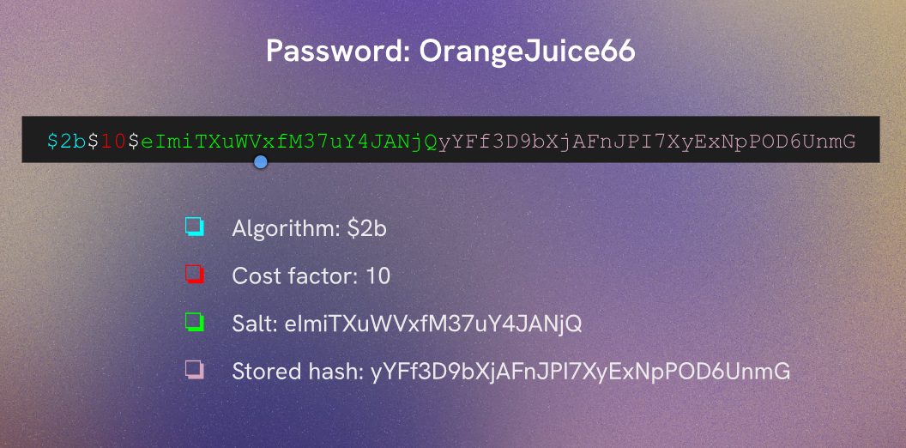

# Aside : Hash & bcrypt

Hashing is a one-way function that converts input data into a fixed-size string of characters, which is typically a hash value. It is commonly used for securely storing passwords. When a user creates an account, their password is hashed and stored in the database. When they log in, the entered password is hashed again and compared to the stored hash.

## Hasing with bcrypt

## Rainbow Tables

Rainbow tables are precomputed tables used to reverse cryptographic hash functions. They are used to crack password hashes by comparing the hash of a password against the precomputed hashes in the table. This is why it is important to use a strong hashing algorithm like bcrypt, which incorporates a salt and is computationally expensive, making it resistant to rainbow table attacks.

There is a way of defending against rainbow table attacks, which is to use a salt. A salt is a random value that is added to the password before hashing. This means that even if two users have the same password, their hashes will be different because of the unique salt. Bcrypt automatically generates a salt and incorporates it into the hash, making it a secure choice for password hashing.

Bcrypt is designed to be slow, which makes it more resistant to brute-force attacks. The cost factor can be adjusted to increase the time it takes to hash a password, providing an additional layer of security as computing power increases over time.