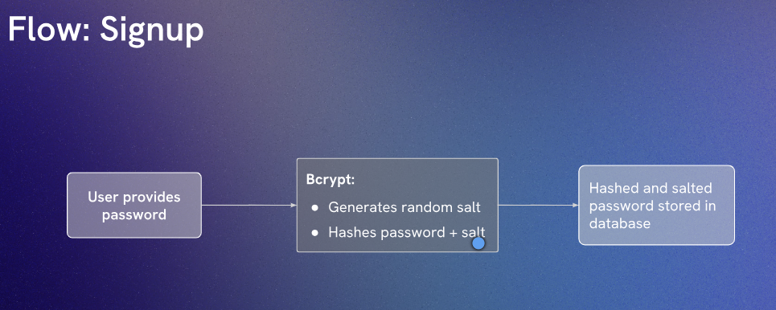
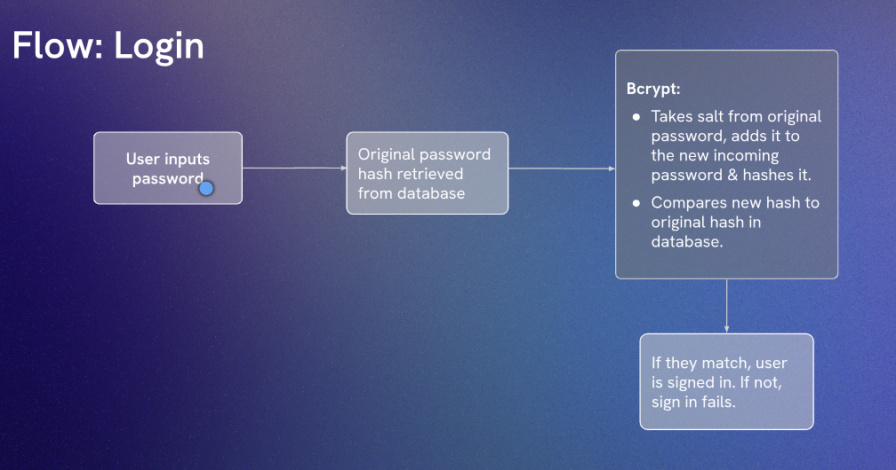

# bcryptjs Demo

## Login & Signup flow





we can install `bcryptjs` package to hash our passwords.

```bash
npm install bcryptjs
```

`Cost factor` is the number of rounds of hashing to apply. The higher the cost factor, the more time it takes to hash a password, which can help protect against brute-force attacks. A common cost factor is 10, which means that the hashing algorithm will be applied 2^10 (1024) times.

Inside our `server.js` file, we can import the `bcryptjs` package and use it to hash passwords during signup and compare hashes during login.

```javascript
import express from 'express'
import bcrypt from 'bcryptjs'

const password = 'skywalker96'

const hashed = await bcrypt.hash(password, 10)

console.log(hashed)

const app = express()

app.listen(8000, () => console.log('listening 8000'))
``` 
Here, we are hashing the password 'skywalker96' with a cost factor of 10. The resulting hash will be printed to the console. During the login process, we can use `bcrypt.compare()` to compare the entered password with the stored hash.

```javascript
import express from 'express'
import bcrypt from 'bcryptjs'

// const password = 'skywalker96'

// const hashed = await bcrypt.hash(password, 10)
// console.log(hashed)

const userInDb = {
  name: 'Luke Skywalker',
  password: '$2b$10$pyzxk19lHZbx/aGmjbVGeOswnmX7lwxnDg2RQUhnOSMhFeRYaXtSq'
} 

const loginAttempt = {
  name: 'Luke Skywalker',
  password: 'skywalker96'
}

const userIsValid = await bcrypt.compare(loginAttempt.password, userInDb.password)
console.log(userIsValid)

const app = express()

app.listen(8000, () => console.log('listening 8000'))
```
In this example, we have a user in the database with a hashed password. When a login attempt is made, we use `bcrypt.compare()` to check if the entered password matches the stored hash. The result will be `true` if the passwords match and `false` otherwise.

