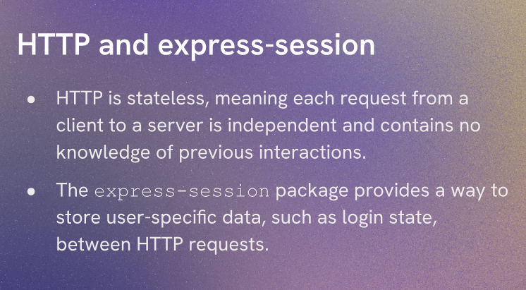
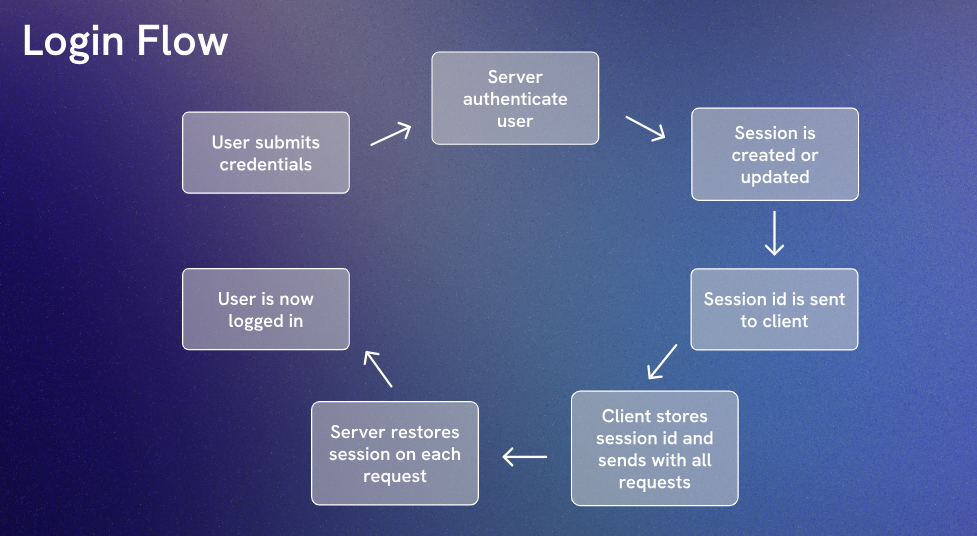

# Aside : express - session

Express session is a middleware that allows you to manage user sessions in your Express applications. It provides a way to store data on the server side and associate it with a unique session ID that is sent to the client as a cookie. This allows you to maintain stateful information across multiple requests from the same user.

`req.session.userId` is a common way to store the user's unique identifier in the session after they have successfully logged in. This allows you to easily access the user's information in subsequent requests without having to query the database for their credentials every time.

By default session data is stored in memory, which is not suitable for production environments. In production, you should use a session store like Redis or MongoDB to persist session data across server restarts and to handle multiple server instances.